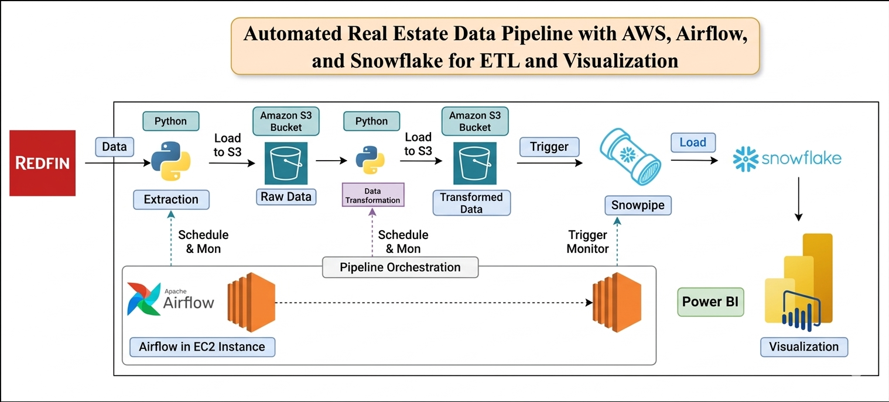

### **Project Overview**

This project builds a scalable ETL pipeline to extract, transform, and load real estate data from Redfin into Snowflake using AWS. The processed data is visualized in Power BI for insights.

---

### **Workflow**

* **Extraction:** Data is fetched using Python and stored in AWS S3
* **Transformation:** Data is cleaned and transformed using Python, then saved to another S3 bucket
* **Loading (Snowpipe):** Snowpipe automatically loads data from S3 into Snowflake
* **Visualization:** Snowflake data is connected to Power BI for dashboards
* **Orchestration:** Apache Airflow (on EC2) schedules and monitors the pipeline

---

### **Architecture Components**

* **AWS S3** – Storage for raw and transformed data
* **Python** – Data extraction and transformation
* **Snowflake** – Data warehouse for analytics
* **Apache Airflow** – Pipeline orchestration
* **Power BI** – Data visualization
* **AWS EC2** – Hosts Airflow

---

### **Technologies Used**

* Python
* AWS S3
* Apache Airflow
* Snowflake
* Power BI
* AWS EC2

---

### **Key Features**

* Automated data ingestion from Redfin
* Scheduled ETL pipeline using Airflow
* Real-time data loading via Snowpipe
* Interactive dashboards in Power BI

