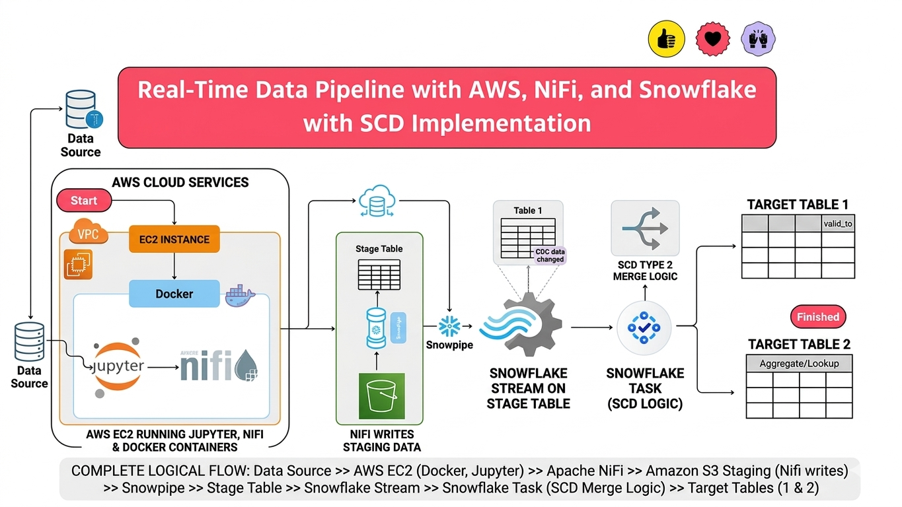

### **Introduction**

This project builds a real-time data pipeline for continuous ingestion and transformation into Snowflake. It uses cloud technologies to implement Change Data Capture (CDC) and Slowly Changing Dimensions (SCD) for managing historical data.

---

### **Tech Stack**

* **Languages:** Python, SQL, JavaScript
* **Tools/Services:** Apache NiFi, Amazon S3, Snowflake, AWS EC2, Docker

---

### **Dataset Description**

Synthetic user data is generated using Python (Faker) and stored in CSV files with timestamps.

**Fields:**
Customer_id, First_name, Last_name, Email, Street, State, Country

---

### **Process Flow**

* **Data Generation (EC2):** Python scripts create CSV files
* **Data Movement (NiFi):** Monitors folder and uploads files to S3
* **Data Ingestion (Snowpipe):** Loads data from S3 to Snowflake staging table
* **Transformation (Snowflake):**

  * MERGE (CDC) → insert/update/delete
  * Truncate staging table after load
* **Historical Tracking:**

  * Snowflake Stream captures changes
  * SCD Type 1 & Type 2 applied for history

---

### **Key Concepts Learned**

* End-to-end data pipeline design
* Change Data Capture (CDC)
* Slowly Changing Dimensions (SCD)
* NiFi flow creation & S3 integration
* Snowflake components (Snowpipe, Stream, Task)
* Docker setup and containerization
* AWS EC2, S3, and access configuration

---

### **Benefits**

* Near real-time data pipeline
* Automated ingestion and processing
* Historical data tracking (SCD)
* Scalable cloud-based architecture

---

### **Quick Notes**

* **NiFi:** Automates data flow between systems
* **Docker:** Runs services in containers
* **EC2:** Virtual server for hosting tools
* **S3:** Cloud storage for data
* **Snowflake:** Cloud data warehouse

---

### **SCD (Short Explanation)**

* **Type 1:** Overwrites old data (no history)
* **Type 2:** Keeps full history (new record for changes)
* **Type 3:** Stores limited history (current + previous value)
