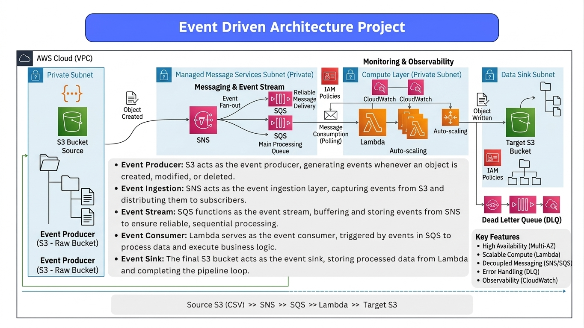

**Event-Driven Architecture with AWS**

This project builds a real-time data pipeline using AWS services. It processes events from S3 with SNS, SQS, and Lambda for scalable and reliable data handling.

**Components:**

* **S3 (Producer):** Generates events on object changes
* **SNS (Ingestion):** Distributes events to subscribers
* **SQS (Queue):** Buffers events for reliable processing
* **Lambda (Consumer):** Processes events and applies logic
* **S3 (Sink):** Stores processed data

**Workflow:**

1. Event triggered in source S3 bucket
2. SNS sends event to SQS
3. SQS queues the event
4. Lambda processes and transforms data
5. Output stored in target S3 bucket

