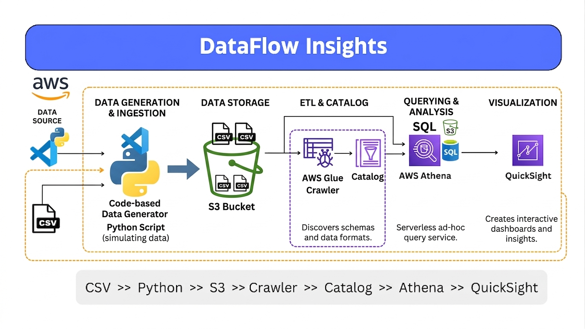

**DataFlow Insights – Overview**

**Introduction:**
A serverless AWS pipeline that converts raw CSV data into insights using a data lake and analytics tools (schema-on-read approach).

**Tech Stack:**
Python, VS Code, AWS S3, AWS Glue, Athena, QuickSight

**Process Flow:**

1. Python uploads CSV data to S3
2. Glue Crawler scans and detects schema
3. Metadata stored in Glue Data Catalog
4. Athena runs SQL queries on S3 data
5. QuickSight creates dashboards

**Key Concepts:**

* Serverless architecture
* Data lake (S3)
* Auto schema detection (Glue)
* Query without loading (Athena)

**Benefits:**

* Scalable and cost-efficient
* Low maintenance (fully managed)
* Flexible with new data changes

**Notes:**

* Use proper IAM permissions
* Convert CSV → Parquet for performance
* Partition data in S3 to reduce cost

