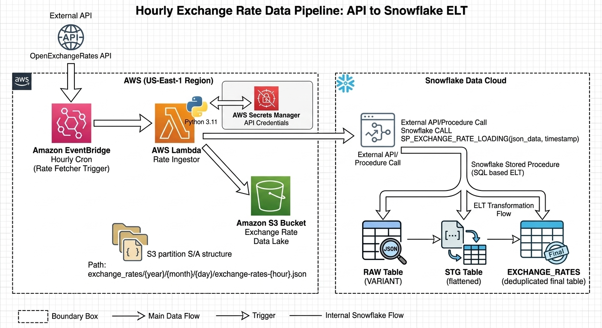

**💱 FX Pulse — Overview**

A serverless pipeline that fetches live exchange rates hourly, stores raw data in S3, and loads structured data into Snowflake for analytics using Lambda and EventBridge.

**Architecture Flow:**
API → EventBridge (hourly) → Lambda → S3 (JSON) + Snowflake (Stored Procedure)
Snowflake Layers: **RAW → STG → EXCHANGE_RATES**

**Key Features:**

* Fully serverless & automated (hourly)
* Dual storage: S3 (raw) + Snowflake (processed)
* Secure via Secrets Manager
* Idempotent loads (MERGE avoids duplicates)
* Partitioned S3 storage (year/month/day/hour)

**AWS Setup (Summary):**

* Lambda (Python 3.11, ~512MB)
* EventBridge (rate: 1 hour)
* Secrets Manager for credentials
* IAM roles for S3, Lambda, EventBridge access

**Snowflake Flow:**

* Load JSON → RAW
* Flatten → STG
* MERGE → Final table (no duplicates)

**Tech Stack:**
AWS Lambda, EventBridge, S3, Secrets Manager, Snowflake, OpenExchangeRates API

**Note:**
Use Parquet + partitioning in S3 for better performance and lower cost.
