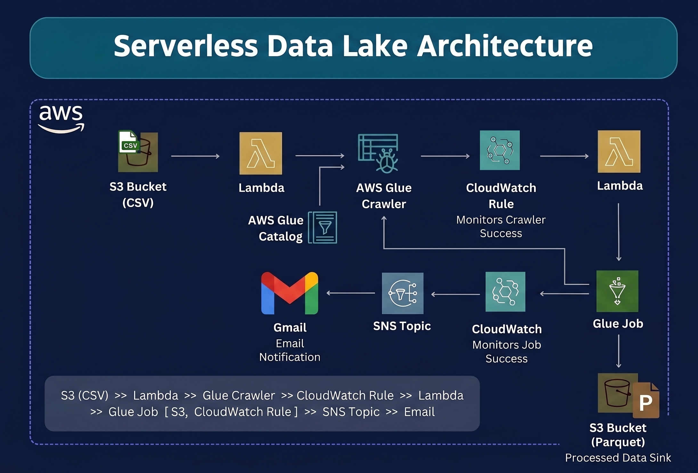

**💱 FX Pulse — Overview**

A serverless pipeline that fetches live exchange rates hourly, stores raw data in S3, and loads structured data into Snowflake for analytics using Lambda and EventBridge.

**Architecture Flow:**
API → EventBridge (hourly) → Lambda → S3 (JSON) + Snowflake (Stored Procedure)
Snowflake Layers: **RAW → STG → EXCHANGE_RATES**

**Key Features:**

* Fully serverless & automated (hourly)
* Dual storage: S3 (raw) + Snowflake (processed)
* Secure via Secrets Manager
* Idempotent loads (MERGE avoids duplicates)
* Partitioned S3 storage (year/month/day/hour)
