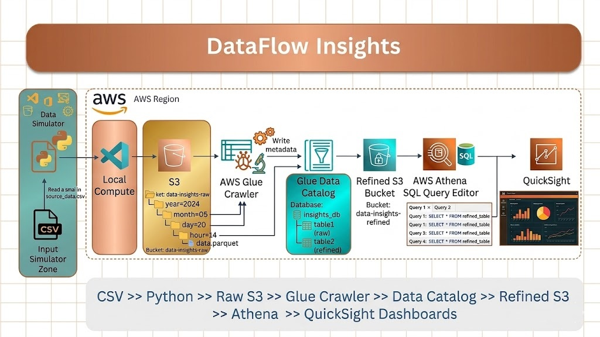

## Project Overview:

This end-to-end serverless ETL pipeline ingests, transforms, and analyzes global COVID-19 datasets, moving raw multi-source data into a high-performance data warehouse.

```
[Raw S3 Data] ➔ [AWS Glue Crawler] ➔ [Glue Catalog] ➔ [Athena (Ad-hoc SQL)]
                         ⬇
                 [AWS Glue ETL Job] ➔ [Transformed Parquet in S3] ➔ [Amazon Redshift]

```
## Project Architecture:



---

## Core Component Breakdown

### 1. Storage & Discovery (Data Lake)

* **Amazon S3 (Data Lake):** Acts as both the raw landing zone (CSV/JSON formats) and the optimized processed storage layer.
* **AWS Glue Data Catalog:** Automatically updates and maintains the metadata catalog and schema definitions.

### 2. Orchestration & Processing (ETL)

* **AWS Glue Crawlers:** Scan incoming S3 data to infer schemas and populate catalog tables dynamically.
* **AWS Glue ETL (Spark):** Cleans, filters, and transforms messy source data into optimized, columnar **Apache Parquet** format.

### 3. Analytics & Warehousing (Serving Layer)

* **Amazon Athena:** Provides a serverless, pay-per-query engine to run immediate ad-hoc SQL queries directly on the S3 data lake.
* **Amazon Redshift:** Serves as the centralized cloud data warehouse, storing aggregated, high-performance data structures optimized for complex BI reporting and heavy analytics.

---

## Visual Pipeline Design

To present this visually in a professional architecture diagram, group your existing components into three distinct conceptual boundaries:

* **Ingestion & Landing Zone:** Amazon S3 (Raw Bucket).
* **Serverless Data Lake Layer:** AWS Glue (Crawlers, Catalog, Spark ETL) + Amazon Athena for ad-hoc exploration.
* **Enterprise Serving Layer:** Amazon Redshift acting as the final, structured destination for BI tools.


---
